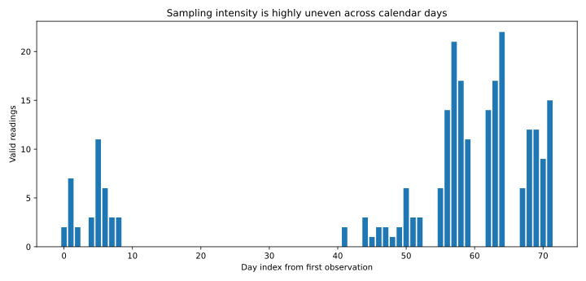

# Missing Data Is Not Empty Space: Statistical Analysis of an Irregular Blood-Pressure Tracker

A time series is not defined only by its observed values. It is also defined by **when we chose to observe it**.

This case study starts from a small personal blood-pressure workbook and asks a more interesting statistical question than simply plotting systolic and diastolic values over time:

> What can we infer when the measurement process itself is irregular, clustered, and heavily missing?

The source workbook is intentionally **not committed** to this public repository. It contains personal health information. The public data in `data/analysis_snapshot.csv` are day-indexed aggregate statistics with calendar dates and row-level context removed.

This is a statistical analysis, not medical advice or a clinical interpretation.

## 1. Data audit before modelling

The workbook contains 151 rows below the header, but they are not 151 measurements.

| Item | Count |
|---|---:|
| Valid measurements | 144 |
| Blank placeholder rows | 6 |
| Spreadsheet summary rows | 1 |
| Measurement sessions after 15-minute sessionisation | 79 |

Two structural issues matter immediately.

### 1.1 A date-format inversion

The early part of the workbook contains a coherent run of dates that Excel parsed as month/day although the row sequence and a later text date show that the intended entry order was day/month. Thirty measurements are affected by that early inversion, and two later text rows require the same explicit day/month repair.

The correction is treated as a **data-quality rule**, not as a hidden preprocessing convenience. A longitudinal model with the wrong time axis is worse than no model at all.

### 1.2 Blank rows create false zero pulse pressure

Pulse pressure is stored as

\[
P_i = S_i - D_i,
\]

where \(S_i\) and \(D_i\) denote systolic and diastolic pressure. The six placeholder rows have blank systolic and diastolic values but a derived value of zero. As a result, the workbook summary reports a mean pulse pressure of **38.57 mmHg**, while the cleaned mean over actual measurements is **40.17 mmHg**.

That is a **4.0% downward bias caused entirely by placeholder rows**.

The other numerical averages are unaffected because spreadsheet `AVERAGE` ignores blank cells, whereas the derived pulse-pressure cells contain literal zero values.

## 2. The missingness is substantial

After repairing the time axis, the public analysis window contains 64 calendar days.

- 25 days contain at least one valid measurement.
- 39 days contain no measurement.
- Calendar-day coverage is **39.1%**.
- Calendar-day missingness is **60.9%**.
- The longest uninterrupted gap is **32 days**.
- That single gap accounts for **82.1% of all missing calendar days**.



This is not the kind of missingness for which linear interpolation is a harmless convenience. A 32-day gap is a region of uncertainty, not a line segment waiting to be filled.

## 3. Measurement intensity is also irregular

Even among observed days, the number of measurements varies sharply.

| Statistic | Readings per observed day |
|---|---:|
| Mean | 5.76 |
| Median | 3 |
| Q1 | 2 |
| Q3 | 6 |
| Minimum | 1 |
| Maximum | 21 |

This matters because a mean across all 144 readings gives more weight to days on which more measurements happened to be taken.

For systolic pressure:

\[
\bar{S}_{\text{reading-weighted}} = 115.85,
\]

while giving each observed calendar day equal weight gives

\[
\bar{S}_{\text{equal-day}} = 118.27.
\]

The difference is **-2.41 mmHg**. The same effect appears for diastolic pressure and heart rate.

| Quantity | Reading-weighted mean | Equal-observed-day mean | Difference |
|---|---:|---:|---:|
| Systolic (mmHg) | 115.85 | 118.27 | -2.41 |
| Diastolic (mmHg) | 75.68 | 77.30 | -1.62 |
| Pulse pressure (mmHg) | 40.17 | 40.97 | -0.79 |
| Heart rate (bpm) | 92.47 | 94.05 | -1.59 |

The observed number of readings per day is negatively associated with the observed daily systolic mean:

\[
r_{\text{Pearson}}=-0.485,\qquad p=0.014,
\]

and

\[
\rho_{\text{Spearman}}=-0.440,\qquad p=0.028.
\]

With only 25 observed days, these p-values should not be fetishised. The useful result is structural: **sampling intensity and the quantity being summarised are not behaving as if they were independent**. Treating all 144 rows as exchangeable i.i.d. observations is therefore a poor default.

## 4. Repeated readings should be treated as sessions

Within observed days, repeated measurements often occur five minutes apart. Consecutive readings no more than 15 minutes apart were therefore grouped into a measurement session.

This produces 79 sessions:

- 37 sessions contain one reading;
- 19 contain two readings;
- 23 contain three readings.

The analysis therefore has three distinct levels:

1. **Reading level** for data validation and within-session variation.
2. **Session level** for repeated measurements taken close together.
3. **Calendar-day level** for longitudinal summaries where each observed day receives equal weight.

Collapsing these levels into a single flat table exaggerates the effective sample size.

## 5. Missing labels are not automatically negative labels

Among valid measurements, the fields `Pill`, `Home`, and `Sleep` are complete. The fields `Meal` and `Symptoms` are not:

| Field | Missing rows | Missing rate |
|---|---:|---:|
| Meal | 120 | 83.3% |
| Symptoms | 129 | 89.6% |

A blank `Symptoms` cell should not automatically become `No symptoms`, and a blank `Meal` cell should not automatically become `No meal`. Without a data-collection rule that defines blank as a meaningful negative category, these are **unknown/not-recorded values**.

That distinction matters for any later regression using those fields.

## 6. Exploratory longitudinal trend

A simple day-level linear model was fitted only to observed days,

\[
y_t = \beta_0 + \beta_1 t + \varepsilon_t,
\]

with HC3 heteroskedasticity-robust standard errors. The resulting 30-day slopes are:

| Outcome | Estimated change per 30 days | 95% CI |
|---|---:|---:|
| Systolic pressure | -4.27 mmHg | [-6.70, -1.83] |
| Diastolic pressure | -3.03 mmHg | [-4.62, -1.43] |
| Pulse pressure | -1.24 mmHg | [-2.97, 0.49] |
| Heart rate | -3.42 bpm | [-5.99, -0.86] |

These are **descriptive trends, not causal effects and not clinical conclusions**. The measurement schedule changes substantially over the observation window, so a temporal trend can partly reflect changing measurement behaviour or context.

## 7. Do not turn missing days into fake observations

For visualising the latent trajectory, a local-linear-trend Gaussian state-space model is preferable to deterministic interpolation:

\[
y_t = \mu_t + \varepsilon_t,
\]

\[
\mu_{t+1} = \mu_t + \beta_t + \eta_t,
\]

\[
\beta_{t+1} = \beta_t + \zeta_t.
\]

The missing calendar days are supplied to the Kalman filter as missing observations. The smoother estimates a latent level, but the unobserved days remain unobserved. Their uncertainty is carried explicitly by the state covariance.

This is the key distinction:

> A model can estimate a latent process through a gap. It does not recover measurements that were never taken.

For that reason, the state-space estimates in this project are used for visualisation and sensitivity analysis, not as replacement rows in the dataset.

## 8. What can we say about the missing-data mechanism?

The usual taxonomy is:

- **MCAR**: missing completely at random;
- **MAR**: missingness depends on observed information;
- **MNAR**: missingness depends on unobserved information.

The tracker does not contain enough information to identify one of these mechanisms from the data alone. In particular, MNAR is generally not testable without additional assumptions because the values relevant to the missingness mechanism are precisely the values that were not observed.

What we can say is narrower and more defensible:

1. Calendar coverage is low and dominated by one long gap.
2. Sampling intensity varies greatly across observed days.
3. Sampling intensity is associated with observed daily pressure levels.
4. Therefore, a naïve reading-level analysis should not assume that the observation process is ignorable.

## 9. Reproducibility and privacy

The repository contains:

- `data/analysis_snapshot.csv`: one row per relative calendar day, with dates removed;
- `data/source_audit.json`: aggregate data-quality counts only;
- `analysis.py`: validation, statistics, robust trends, and state-space smoothing;
- `figures/results.json`: machine-readable output from the analysis.

The raw workbook is excluded from version control because this repository is public.

To reproduce the public analysis snapshot and regenerate the figures:

```bash
python -m pip install -r requirements.txt
python analysis.py \
  --data data/analysis_snapshot.csv \
  --audit data/source_audit.json \
  --output-dir figures
```

## 10. Statistical conclusions

The most important result is not a particular blood-pressure estimate. It is the observation design.

The dataset contains enough information for descriptive and exploratory longitudinal statistics, but the missingness and changing sampling intensity make a flat i.i.d. analysis misleading. A defensible workflow is therefore:

\[
\text{raw rows}
\rightarrow
\text{data-quality audit}
\rightarrow
\text{sessionisation}
\rightarrow
\text{equal-day summaries}
\rightarrow
\text{explicit missing calendar grid}
\rightarrow
\text{robust trend / state-space model}
\rightarrow
\text{uncertainty, not invented data}.
\]

That is the broader lesson of this tracker: **missing data are part of the statistical process, not an inconvenience to erase before modelling.**
